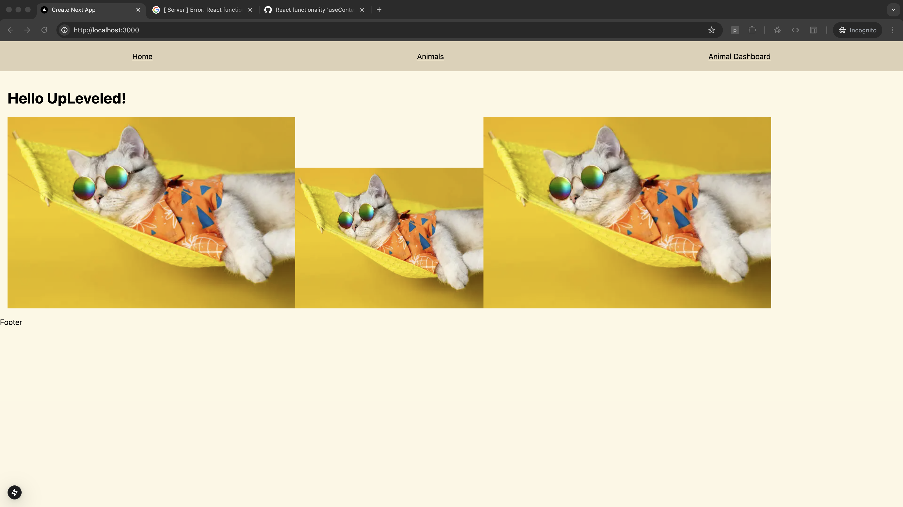
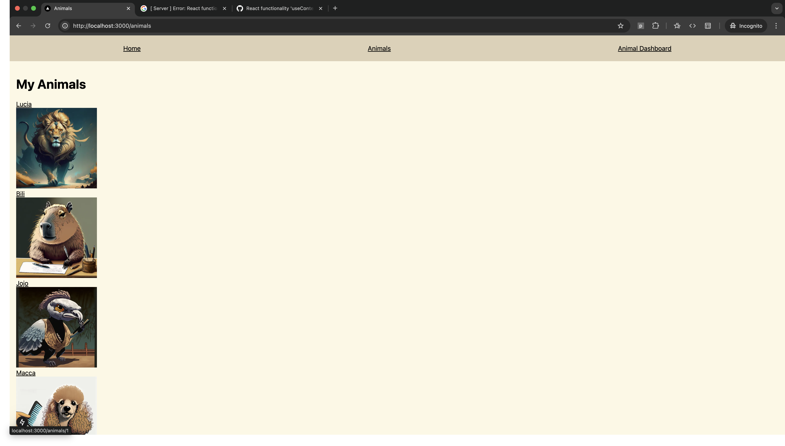
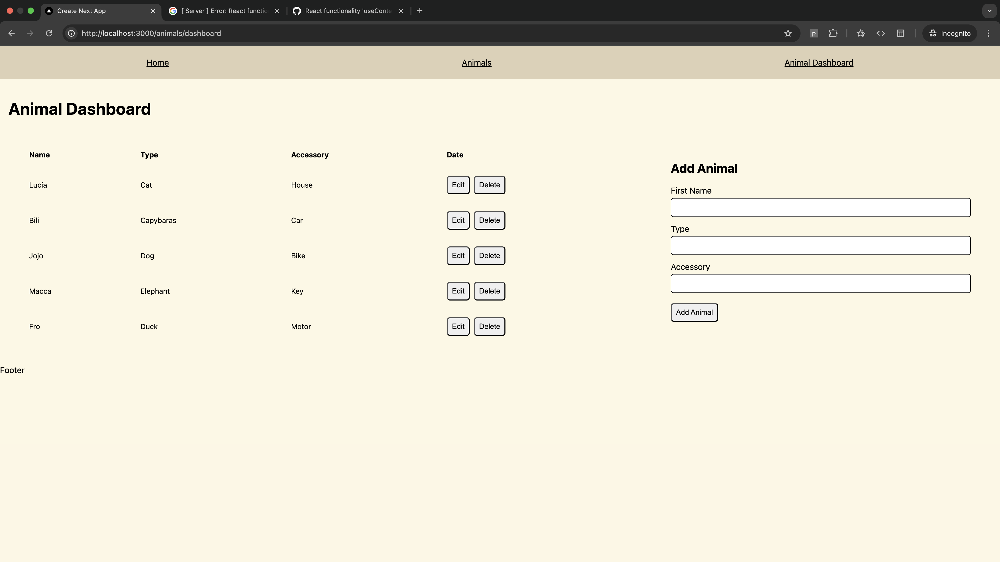

# UpLeveled GraphQL example - Winter 2025

The GraphQL example - Winter 2025 is a project that demonstrates how to build a full-stack web application in Next.js that uses GraphQL server and API. It is part of the curriculum for the [UpLeveled Fullstack Web Development Bootcamp](https://upleveled.io/web-development-bootcamp).

## Technologies

- Next.js
- Postgres.js
- Apollo Client
- Apollo Server
